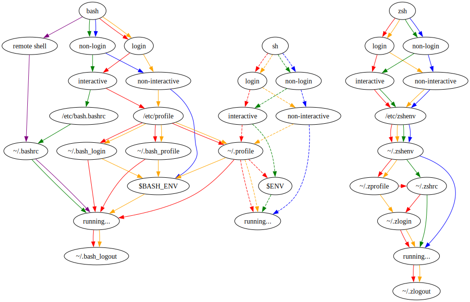
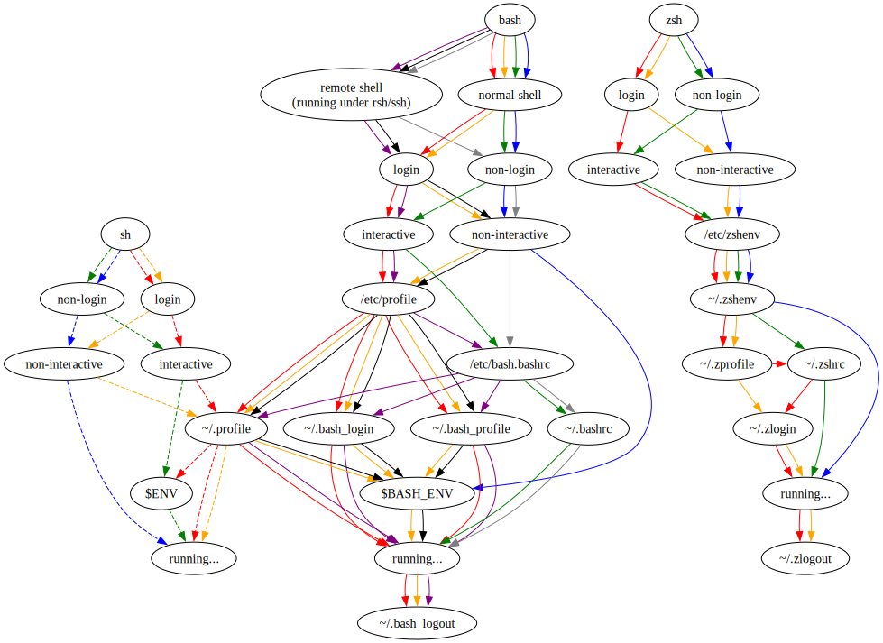

# Bash and ZSH shell startup sequences (the loading order of the script files)

The implementation as infered from the Bash and ZSH manpages:

The _actual_ implementation:

The above SVG images were generated from the Graphviz files authored and published by Peter Ward as part of the article [Shell startup scripts — flowblok’s blog](https://blog.flowblok.id.au/2013-02/shell-startup-scripts.html).

Copyright of the files in the snapshot of the [flowblok / shell-startup · GitLab](https://heptapod.host/flowblok/shell-startup/-/tree/branch/default?ref_type=heads) repository stored in `./shell-startup-branch-default` subdirectory is owned by Peter Ward.

# Resources

- [flowblok / shell-startup · GitLab](https://heptapod.host/flowblok/shell-startup/-/tree/branch/default?ref_type=heads)
- [Shell startup scripts — flowblok’s blog](https://blog.flowblok.id.au/2013-02/shell-startup-scripts.html) ([archived](https://archive.is/20220318215750/https://blog.flowblok.id.au/2013-02/shell-startup-scripts.html))
- [Faster and enjoyable ZSH (maybe) • Alex T.](https://htr3n.github.io/2018/07/faster-zsh/) ([archived](https://archive.is/30xVW))
